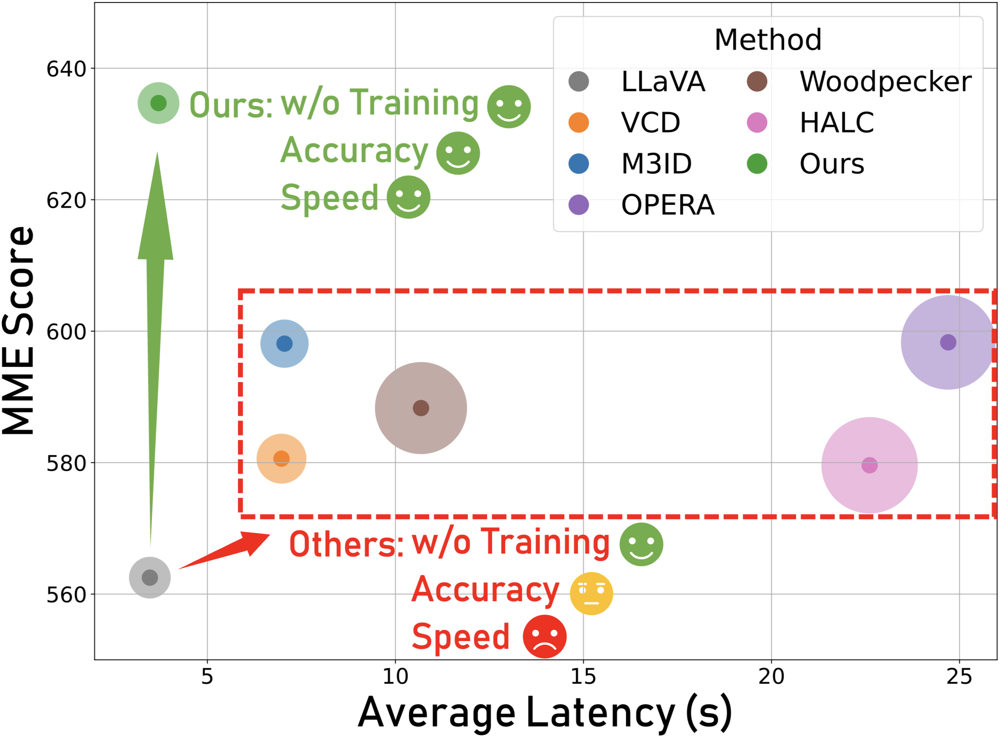
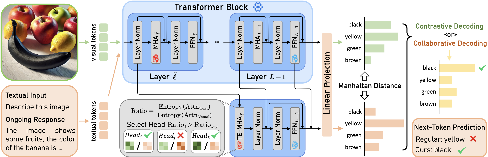

# [ICCV 2025] ONLY

[](https://zifuwan.github.io/) [](https://zifuwan.github.io/) [](https://iccv.thecvf.com/) [](https://opensource.org/licenses/MIT)

## 👀Introduction

This repository contains the code for our ICCV 2025 paper `ONLY: One-Layer Intervention Sufficiently Mitigates Hallucinations in Large Vision-Language Models`. 

<div align="center">
  
  
</div>


## 💡Environment

We test our codebase with PyTorch 2.0.1. Please install corresponding PyTorch and CUDA versions according to your computational resources.

```
conda create -n ONLY python=3.10
conda activate ONLY
git clone https://github.com/zifuwan/ONLY.git
cd ONLY
pip install -r requirements.txt
python -m pip install -e transformers
```

Please also download the model checkpoints:

- [**LLaVA-1.5**](https://github.com/haotian-liu/LLaVA): Download [LLaVA-1.5 merged 7B](https://huggingface.co/liuhaotian/llava-v1.5-7b)
- [**InstructBLIP**](https://github.com/salesforce/LAVIS/tree/main/projects/instructblip): Download [InstructBLIP](https://huggingface.co/Salesforce/instructblip-vicuna-7b)
- [**Qwen-VL-Chat**](https://huggingface.co/Qwen/Qwen-VL-Chat): Download [Qwen-VL-Chat](https://huggingface.co/Qwen/Qwen-VL-Chat/tree/main)

As for the datasets and benchmarks:

- For **MSCOCO** dataset, see [this link](https://cocodataset.org/).
- For **MME**, see [this link](https://github.com/BradyFU/Awesome-Multimodal-Large-Language-Models/tree/Evaluation).

## 📦Usage

We provide the code for evaluating our ONLY on POPE, CHAIR, and MME-Hallucination benchmark. You can simply run the following code to run the experiments:

- POPE: `bash eval_bench/scripts/pope_eval.sh`
- CHAIR:`bash eval_bench/scripts/chair_eval.sh`
- MME:`bash experiments/cd_scripts/mme_eval.sh`

## 🙏Acknowledgements

Our codebase is adapted from  [RITUAL](https://github.com/sangminwoo/RITUAL), [VCD](https://github.com/DAMO-NLP-SG/VCD), [OPERA](https://github.com/shikiw/OPERA), [LLaVA](https://github.com/haotian-liu/LLaVA), and [DeGF](https://github.com/zhangce01/DeGF/tree/main). We thank the authors for releasing their code!

## 📧Contact

If you have any questions, please  contact at [zifuw@andrew.cmu.edu](mailto:zifuw@andrew.cmu.edu).

## 📌 BibTeX & Citation

If you find this code useful, please consider citing our work:

```bibtex
coming soon
```
